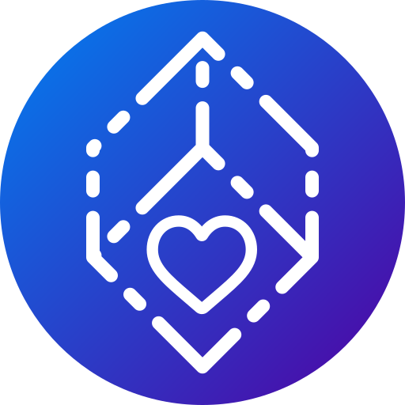
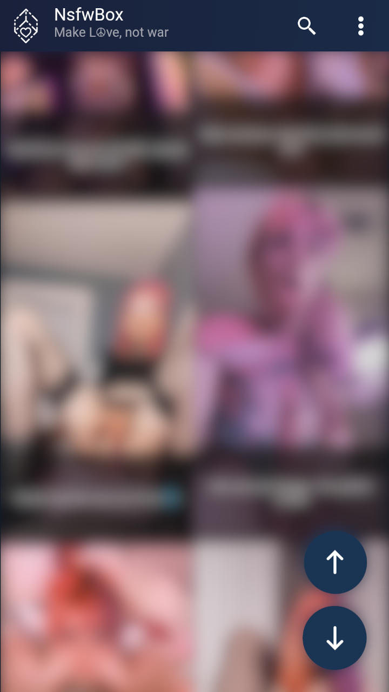
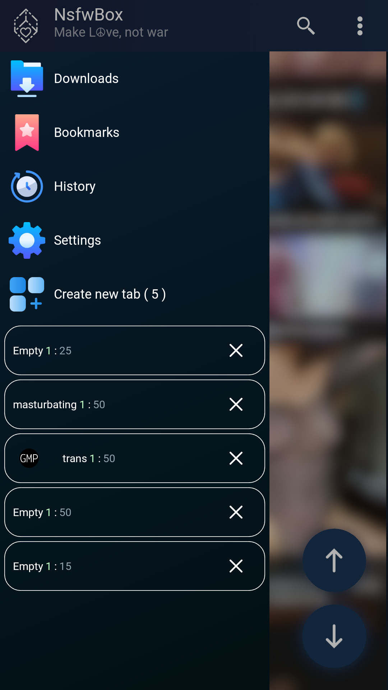
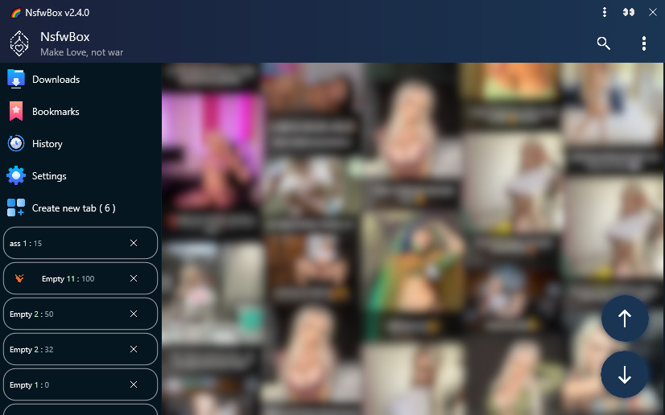
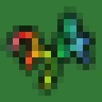
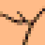

<h1 align="left">NsfwBox</h1>

  

Native android and windows app for download content from porn sites.  
Developed on RAD Studio 11 Alexandria.

### Censored screenshots:

#### Android:

  
  
  

    
Windows:

    <pre>
      
    </pre>

 

[✨ About user interface design ✨](./assets/themes#readme)

#### Supported sites / APIs:
* [nsfw.xxx](https://nsfw.xxx), [pornpic.xxx](https://pornpic.xxx/), [hdporn.pics](https://hdporn.pics/)
* [Rule34 Json API](https://github.com/KuroZen/r34-json-api)
* [givemeporn.club](https://givemeporn.club/)
* [kemono.party](https://kemono.party), [coomer.party](https://coomer.party)
* [9hentai.to](https://9hentai.to)
* [motherless.com](https://motherless.com)
* [fapello.com](https://fapello.com)
* [rule34.xxx](https://rule34.xxx)
* [gelbooru.com](https://gelbooru.com)
* [realbooru.com](https://realbooru.com)
* [rule34.us](https://rule34.us)
* [rule34.paheal.net](https://rule34.paheal.net)
* [xbooru.com](https://xbooru.com)
* [tbib.org](https://tbib.org)
* [danbooru.donmai.us](https://Danbooru.donmai.us)
* [hypnohub.net](https://hypnohub.net)
* [booru.allthefallen.moe](https://Booru.allthefallen.moe)
* [bleachbooru.org](https://bleachbooru.org)
* [hgoon.booru.org](https://hgoon.booru.org)
* [illusioncards.booru.org](https://illusioncards.booru.org)
* [db.bepis.moe](https://db.bepis.moe/)
* [e621.net](https://e621.net)
<!-- *  -->

    
Dependencies list.

    <pre>
    <a href="https://github.com/Zeus64/Alcinoe">Alcinoe</a>
    <a href="https://sourceforge.net/p/zeoslib/code-0/HEAD/tree/branches/8.0-patches/">ZeosLib 8.0</a>
    <a href="https://github.com/csm101/x-superobject">x-superobject</a>
    <a href="https://github.com/Kisspeace/you-did-well">you-did-well</a>
    <a href="https://github.com/RomanYankovsky/HTMLp">HTMLp</a>
    <a href="https://github.com/radprogrammer/HTMLParserEx">HTMLParserEx</a>
    <a href="https://github.com/Kisspeace/delphi-r34.app-api-wrapper">delphi-r34.app-api-wrapper</a>
    <a href="https://github.com/Kisspeace/delphi-r34-json-api-wrapper">delphi-r34-json-api-wrapper</a>
    <a href="https://github.com/Kisspeace/delphi-nsfw.xxx-scraper">delphi-nsfw.xxx-scraper</a>
    <a href="https://github.com/Kisspeace/delphi-givemeporn.club-scraper">delphi-givemeporn.club-scraper</a>
    <a href="https://github.com/Kisspeace/delphi-9hentai.to-api-wrapper">delphi-9hentai.to-api-wrapper</a>
    <a href="https://github.com/Kisspeace/coomer.party-scraper">coomer.party-scraper</a>
    <a href="https://github.com/Kisspeace/motherless.com-scraper">motherless.com-scraper</a>
    <a href="https://github.com/Kisspeace/fapello.com-scraper">fapello.com-scraper</a>
    <a href="https://github.com/Kisspeace/BooruScraper">BooruScraper</a>
    <a href="https://github.com/DelphiWorlds/Kastri">Kastri</a>
    <!--  -->
    </pre>

  
   

### Download last release:
[-1A2541?style=for-the-badge&logo=android&logoColor=white)](https://github.com/Kisspeace/NsfwBox/releases/latest/download/Kisspeace.NsfwBox.v3.2.0.apk)  
[-1A2541?style=for-the-badge&logo=windows)](https://github.com/Kisspeace/NsfwBox/releases/latest/download/Kisspeace.NsfwBox-ins32.v3.2.0.exe)  
[-1A2541?style=for-the-badge&logo=windows)](https://github.com/Kisspeace/NsfwBox/releases/latest/download/Kisspeace.NsfwBox-ins64.v3.2.0.exe)  
